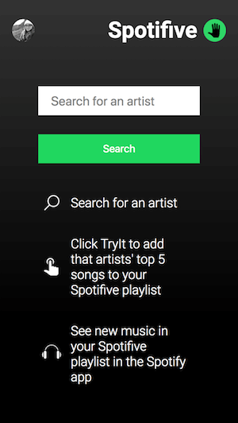
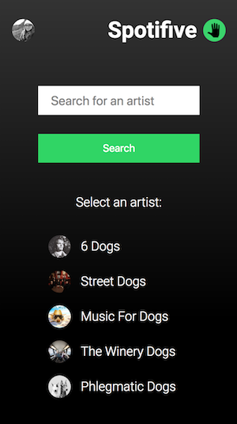

# Spotifive

## Synopsis

Spotifive is an app that helps you quickly add new music to try to a Spotifive playlist in your Spotify account. 
Search for an artist you want to try, click Try It, and that artist's top 5 songs will be added to a **Spotifive** playlist in your Spotify account.

**Try it out here**: [try-spotifive.firebaseapp.com](http://try-spotifive.firebaseapp.com)

### Tools 

* Api data from [Spotify](https://developer.spotify.com/documentation/)
* Hosting by [Firebase](https://firebase.google.com/)

### *Example* 

#### Sign in:

#### Search:

#### Try it:

#### Spotifive on Spotify:

---

## Contributors

Daniela Carey

_(**Turing School of Software & Design Front-end Engineering project - Mod 3:** [Project Spec](http://frontend.turing.io/projects/self-directed-project.html))_ 

